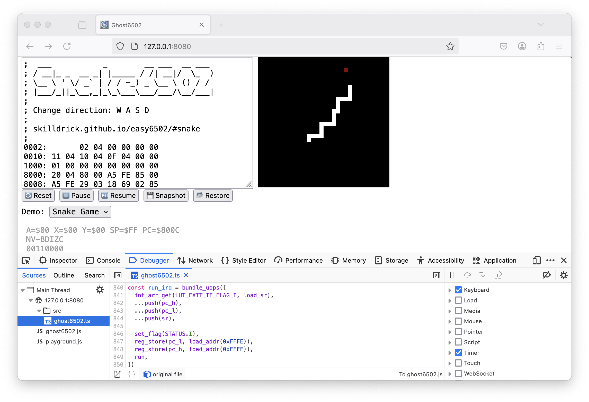
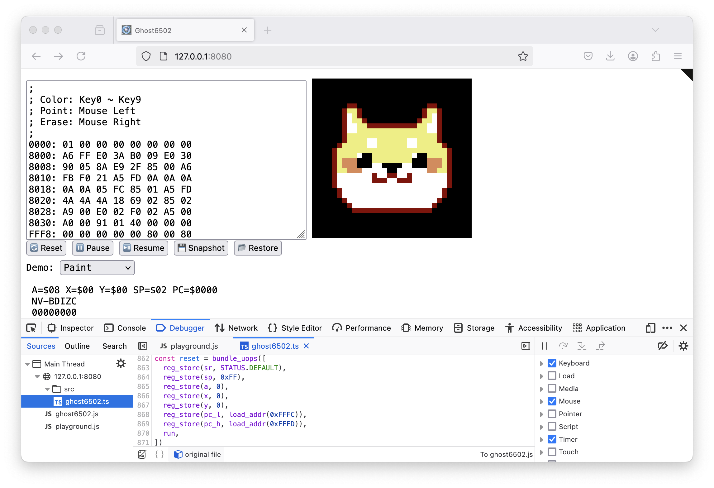

# Ghost6502

A JavaScript 6502 simulator driven by built-in functions.

This project is an experiment in the article "JS Obfuscation: Mining Built-in Functions and Crafting Non-debuggable VMs".


## Demo1

This demo calculates the sum of numbers from 1 to 10:

```javascript
import OP from './opcode.js'
import ghost6502 from './ghost6502.js'

ghost6502.mem.set([
  OP.LDA_IMM, 0,    // A = 0
  OP.LDX_IMM, 1,    // X = 1
  OP.STX_ZPG, 100,  // LOOP:
  OP.ADC_ZPG, 100,  // A += X
  OP.INX,           // X += 1
  OP.CPX_IMM, 11,   // IF X < 11 THEN GOTO LOOP
  OP.BCC,     -9,
])

debugger
ghost6502.reset()   // 👈🏻 Can you step into this function?

alert('sum(1, 10) = ' + ghost6502.reg.a)
```

[http://etherdream.github.io/ghost6502/demo1.html](http://etherdream.github.io/ghost6502/demo1.html)

Open the debugger and you will find that you cannot step into the `ghost6502.reset` function!

In fact, this function performs a lot of operations, but there is no source code for debugging.


## Demo2

This demo reads `P` and `Q` through the input box, calculates their sum, and outputs it via the message box:

```javascript
import OP from './opcode.js'
import ghost6502 from './ghost6502.js'

const inputP = prompt.bind(window, 'Enter the value P', 10)
const inputQ = prompt.bind(window, 'Enter the value Q', 20)
const output = alert.bind(window, ghost6502.bus.data)

ghost6502.bus.mapRead(253, inputP)
ghost6502.bus.mapRead(254, inputQ)
ghost6502.bus.mapWrite(255, output)

ghost6502.mem.set([
  OP.LDA_ZPG, 253,    // A = inputP()
  OP.LDX_ZPG, 254,    // X = inputQ()
  OP.STX_ZPG, 100,    // mem[100] = X
  OP.ADC_ZPG, 100,    // A += mem[100]
  OP.STA_ZPG, 255,    // output(A)
])

debugger
ghost6502.reset()
```

[http://etherdream.github.io/ghost6502/demo2.html](http://etherdream.github.io/ghost6502/demo2.html)

Since the input box and message box are based on built-in functions, the `ghost6502.reset` function is still non-debuggable!


## Demo3

This demo uses a timer to generate interrupts for simulating events: 

```javascript
import OP from './opcode.js'
import ghost6502 from './ghost6502.js'

const obj = document.body
const key = 'textContent'
const val = {
  toString: ''.concat.bind('count: ', ghost6502.bus.data)
}
const display = Reflect.set.bind(null, obj, key, val)
ghost6502.bus.mapWrite(255, display)


const PROGRAM_ADDRESS = 0x8000
const RESET_ADDRESS = 0xFFFC
const IRQ_ADDRESS = 0xFFFE

const program = [
  /* $8000 */ OP.LDX_IMM, 60,     // X = 60
  /* $8002 */ OP.STX_ZPG, 255,    // display(X)
  /* $8004 */ OP.BRK,             // exit reset

  /* $8005 */ OP.INX,             // X++
  /* $8006 */ OP.STX_ZPG, 255,    // display(X)
  /* $8008 */ OP.RTI,             // exit interrupt
]
ghost6502.mem.set(program, PROGRAM_ADDRESS)
ghost6502.mem.set([0x00, 0x80], RESET_ADDRESS)
ghost6502.mem.set([0x05, 0x80], IRQ_ADDRESS)

ghost6502.reset()
setInterval(ghost6502.irq, 1000)
```

[http://etherdream.github.io/ghost6502/demo3.html](http://etherdream.github.io/ghost6502/demo3.html)


Even when the "Timer" option in "Event Listener Breakpoints" is checked, the irq function still cannot be paused by the debugger.


## API

The above Demo3 is configured with a reset vector so that the program can be run from the specified address, whereas Demo1 and Demo2 are not configured, so 0x0000 is used as the default entry address.

If you do not want to set the entry address via the reset vector, you can manually initialize the PC register and start the program using the `run` function:

```javascript
const ENTRY_ADDR = 0x8000
const program = [
  // ...
]
ghost6502.mem.set(program, ENTRY_ADDR)
ghost6502.reg.pc.fill(ENTRY_ADDR)
ghost6502.run()
```

For simplicity and efficiency, this VM does not simulate clock cycles, but uses interpreter loops instead. Each loop executes one instruction.

The run function executes `loop` number of instructions and stops when it encounters BRK (0x00), RTI or an illegal instruction. Additionally, the reset, irq and nmi functions also call the run function internally.

The default value of loop is 2³² - 1, so each call to run can execute enough instructions. You can modify it through the `setLoop` function to customize the time slice:

```javascript
// each run() executes at most 10k instructions
ghost6502.setLoop(10000)

function onTimeSlice() {
  if (ghost6502.run() === -1) {
    return
  }
  requestIdleCallback(onTimeSlice)
}
onTimeSlice()
```

This allows a time-consuming task to be split into multiple executions, so that the main thread will not be blocked for a long time, and this is transparent to the program without changing it.

Furthermore, you can use the `runOp` function to execute a single instruction, which allows for more flexible scheduling. See [index.d.ts](index.d.ts) for details.

You can get the source code from [ghost6502.ts](src/ghost6502.ts), or install it from NPM:

```bash
npm install ghost6502
```

Note that this package does not include the opcode enum file. You can get it from [opcode.js](http://etherdream.github.io/ghost6502/opcode.js) or [opcode.ts](src/opcode.ts).


## Playground

[http://etherdream.github.io/ghost6502/](http://etherdream.github.io/ghost6502/)

This page does not provide compilation capabilities, it only extracts hex codes from the textarea. You can generate assembly hex codes through [virtual 6502](https://www.masswerk.at/6502/assembler.html).

[snake.asm](https://github.com/EtherDream/ghost6502/blob/gh-pages/demos/snake.asm)



[paint.asm](https://github.com/EtherDream/ghost6502/blob/gh-pages/demos/paint.asm)



In addition to the CPU interpreter, keyboard reading, canvas rendering, and register bar updating are also driven by built-in functions, so none of them can be debugged!

|      API     |  Type  |      Address     |         Description        |
|:------------:|:------:|:----------------:|:--------------------------:|
| Mouse Button |  Input |       0xFB       | none: 0, left: 1, right: 2 |
|    Mouse X   |  Input |       0xFC       | [0, 32)                    |
|    Mouse Y   |  Input |       0xFD       | [0, 32)                    |
|    Random    |  Input |       0xFE       | [0, 256)                   |
|   Last Key   |  Input |       0xFF       | ASCII code, 0 if keyup     |
|    Screen    | Output | [0x0200, 0x0600) | 32x32 (1 byte/pixel)       |


## Performance

Here's a performance test using an infinite loop:

```javascript
import OP from './opcode.js'
import ghost6502 from './ghost6502.js'

ghost6502.mem.set([OP.JMP_ABS, 0x00, 0x00])
ghost6502.setLoop(1e6)

const t0 = performance.now()
ghost6502.run()
const t1 = performance.now()

const ips = (1e6 / (t1 - t0) * 1000) | 0
console.log('Speed:', ips.toLocaleString() + ' IPS')
```

[http://etherdream.github.io/ghost6502/perf.html](http://etherdream.github.io/ghost6502/perf.html)

It can reach 1.7 MIPS on my MBP M1 CPU. Due to the differing underlying operations of each instruction, there may be some variations in actual use.

Although the performance is significantly worse than normal JavaScript, it is still several times faster than the original 6502 from decades ago, which ran at 1-3 MHz and only achieved a few hundred kIPS.


## Unsupported features

* Clock cycles

* BCD math

* Software interrupt (The BRK instruction is only used to exit)

* Undocumented opcodes


## TODO

I'm trying to make a non-debuggable NES emulator. The first solution is based on this project, the second solution is to port all the logic to GLSL and run it on the GPU.
